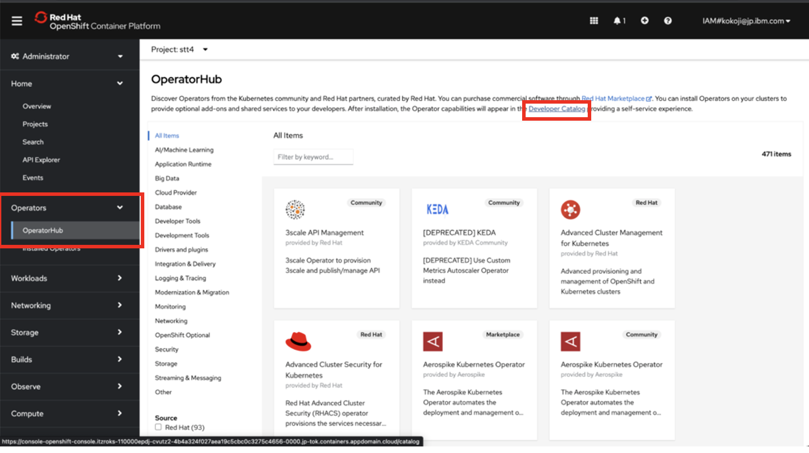
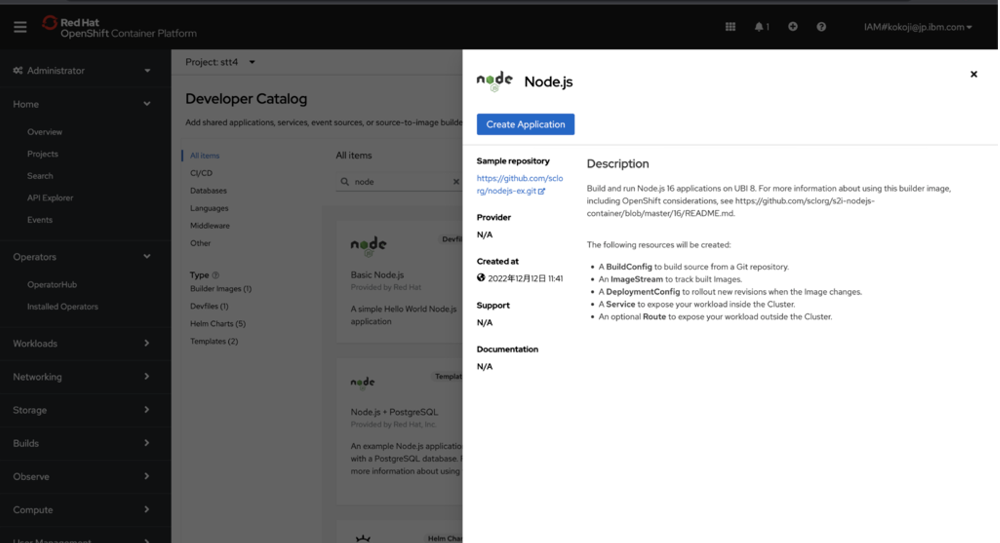
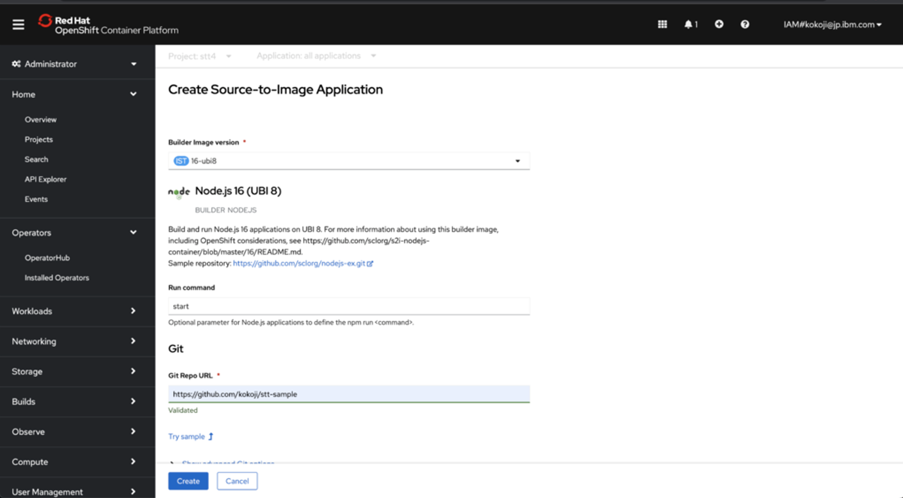
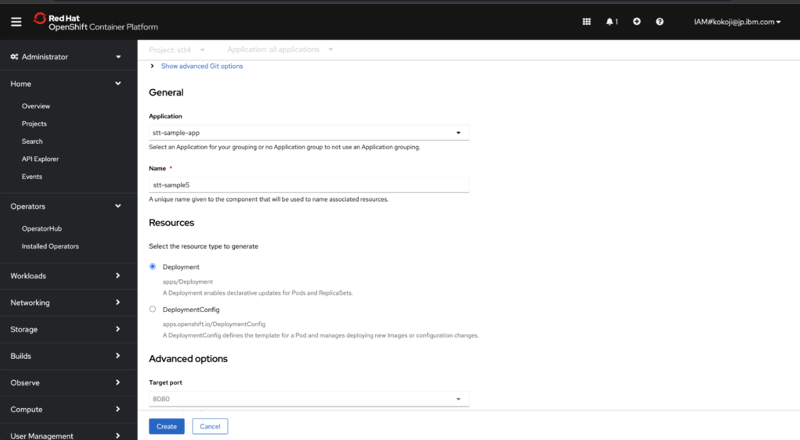
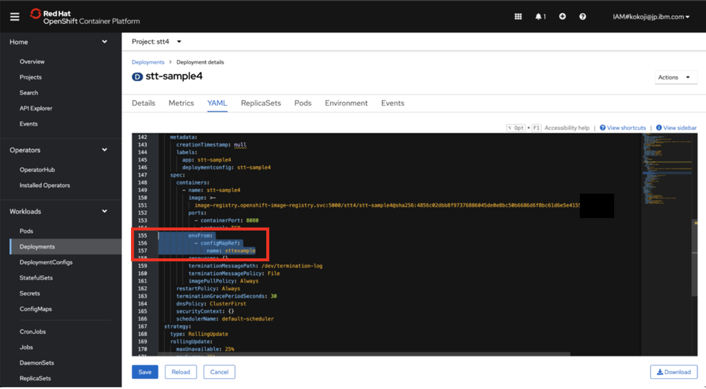
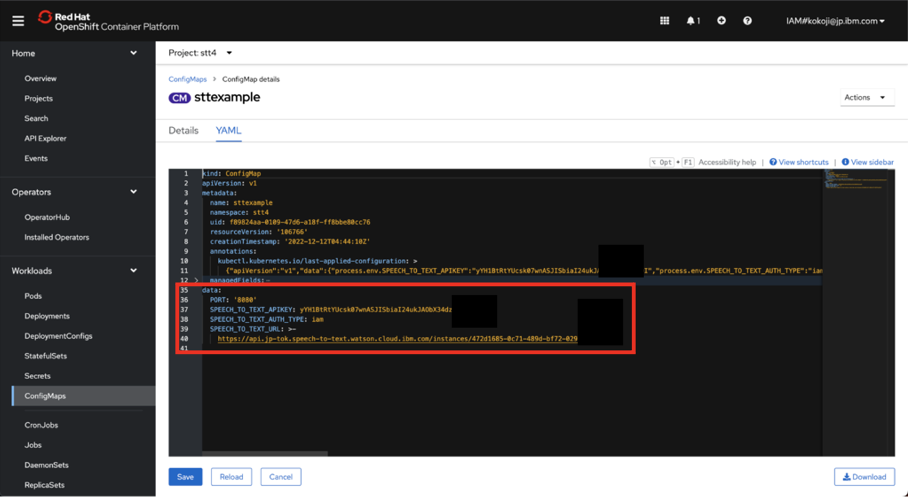

# Speech to Text Code Pattern

このアプリは、基本的には、このサイト( https://github.com/IBM/speech-to-text-code-pattern ) のアプリを使用しています。

そして、そのアプリから、学習などをした、カスタム言語モデルに対して実行できるように変更しています。今のところ、旧モデルのみに対応しています。Multimediaモデルには対応していません。

## ローカルでの実行手順

1. git clone https://github.com/kokoji/stt-sample-custom
2. .env.exampleを.envにコピーし、以下の３つのパラメータを有効にする。
    1. SPEECH_TO_TEXT_AUTH_TYPE=iam
    2. SPEECH_TO_TEXT_APIKEY=[STTのAPIKEY]
    3. SPEECH_TO_TEXT_URL=[STTのURL]
3. src/data/models.json に、アクセスしたいカスタム言語モデルのアクセス情報を記載する。カスタムモデルの記載方法は、src/data/models.json.custom.exampleを参照し必要に応じてmodels.jsonを更新または追記する。（注：models.json の nameはベースのモデル名になるようにする。descriptionの値が、アプリのモデル選択のプルダウンに表示される）
    * カスタム言語モデルのカスタムIDには、以下のように記載する（デフォルトモデルの場合にはnullを指定）。
        * "language_customization_id": "53fe1165-4115-4d32-ac8d-f6x8319exxxx",
    * urlには、以下のように記載する。
        * "url": "https://api.jp-tok.speech-to-text.watson.cloud.ibm.com/instances/{instance_id}/v1/customizations/{customization_id}",
    * nameidは、models.jsonの中で一位になるようにする。例えばja-JP_BroadbandModelをベースにカスタム言語モデルを作成して学習させた場合、学習なしのデフォルトモデルja-JP_BroadbandModelと区別がつくようにする必要がある。
        * "nameid": "xxxx",

3. npm install
4. npm run build
5. npm start
6. localhost:3000 でアプリにアクセス可能

## ROKSでの実行手順

1. Operator Hubを開いて、Developer Catalogをクリック

2. Developer Catalogでnodeと入力。右上のnode.jsをクリック

3. Create Application

4. Run command: start,  gitリポジトリにurlを入力（ここで設定するgitリポジトリは、各自のリポジトリを設定すること。（本リポジトリをcloneし、ローカルの手順３の、src/data/models.jsonを各自のカスタムモデル情報に更新したものを各自のリポジトリにpushする。））

5. nameに名前を入力して createボタン。

6. Deploymentのyamlのspecに以下を追記。(ConfigMapの値を使用するため)

    > envFrom:  
    > ¥- configMapRef:  
    > name: sttexample  

7. Config Mapに.envのパラメータを設定。

8. 初めはエラーになっていたPodがOK、Runningになる。

9. Networking/Routesから、LocationのURLをクリックし、アプリを表示することができる。

以下はベースのアプリの原文のまま。

Sample React app for playing around with the Watson Speech to Text service.

✨ **Demo:** https://speech-to-text-code-pattern.ng.bluemix.net/ ✨

## Flow

1. User supplies an audio input to the application (running locally, in the IBM Cloud or in IBM Cloud Pak for Data).
1. The application sends the audio data to the Watson Speech to Text service through a [WebSocket connection](https://cloud.ibm.com/docs/speech-to-text?topic=speech-to-text-websockets).
1. As the data is processed, the Speech to Text service returns information about extracted text and other metadata to the application to display.

## Steps

1. [Provision Watson Speech to Text](#1-Provision-Watson-Speech-to-Text)
2. [Deploy the server](#2-Deploy-the-server)
3. [Use the web app](#3-Use-the-web-app)

## 1. Provision Watson Speech to Text

The instructions will depend on whether you are provisioning services using IBM Cloud Pak for Data or on IBM Cloud.

**Click to expand one:**

<b>IBM Cloud Pak for Data</b>

<h4>Install and provision</h4>

The service is not available by default. An administrator must install it on the IBM Cloud Pak for Data platform, and you must be given access to the service. To determine whether the service is installed, click the <b>Services</b> icon () and check whether the service is enabled.

<h4>Gather credentials</h4>

<ol>
    <li>For production use, create a user to use for authentication. From the main navigation menu (☰), select <b>Administer > Manage users</b> and then <b>+ New user</b>.</li>
    <li>From the main navigation menu (☰), select <b>My instances</b>.</li>
    <li>On the <b>Provisioned instances</b> tab, find your service instance, and then hover over the last column to find and click the ellipses icon. Choose <b>View details</b>.</li>
    <li>Copy the <b>URL</b> to use as the <b>SPEECH_TO_TEXT_URL</b> when you configure credentials.</li>
    <li><i>Optionally, copy the <b>Bearer token</b> to use in development testing only. It is not recommended to use the bearer token except during testing and development because that token does not expire.</i></li>
    <li>Use the <b>Menu</b> and select <b>Users</b> and <b>+ Add user</b> to grant your user access to this service instance. This is the <b>SPEECH_TO_TEXT_USERNAME</b> (and <b>SPEECH_TO_TEXT_PASSWORD</b>) you will use when you configure credentials to allow the Node.js server to authenticate.</li>
</ol>

<b>IBM Cloud</b>

<h4>Create the service instance</h4>

* If you do not have an IBM Cloud account, register for a free trial account [here](https://cloud.ibm.com/registration).
* Click [here](https://cloud.ibm.com/catalog/services/speech-to-text) to create a **Speech to Text** instance.
  * `Select a region`.
  * `Select a pricing plan` (**Lite** is *free*).
  * Set your `Service name` or use the generated one.
  * Click `Create`.
* Gather credentials
  * Copy the <b>API Key</b> and <b>URL</b> to use when you configure and [deploy the server](#2-Deploy-the-server).

> If you need to find the service later, use the main navigation menu (☰) and select **Resource list** to find the service under **Services**.
Click on the service name to get back to the **Manage** view (where you can collect the **API Key** and **URL**).

## 2. Deploy the server

Click on one of the options below for instructions on deploying the Node.js server.

|   |   |
| - | - |
|  |  |

## 3. Use the web app

* Select an input `Language model` (defaults to English).

* Press the `Play audio sample` button to hear our example audio and watch as it is transcribed.

* Press the `Record your own` button to transcribe audio from your microphone. Press the button again to stop (the button label becomes `Stop recording`).

* Use the `Upload file` button to transcribe audio from a file.

## Developing and testing

See [DEVELOPING.md](DEVELOPING.md) and [TESTING.md](TESTING.md) for more details about developing and testing this app.

## License

This code pattern is licensed under the Apache License, Version 2. Separate third-party code objects invoked within this code pattern are licensed by their respective providers pursuant to their own separate licenses. Contributions are subject to the [Developer Certificate of Origin, Version 1.1](https://developercertificate.org/) and the [Apache License, Version 2](https://www.apache.org/licenses/LICENSE-2.0.txt).

[Apache License FAQ](https://www.apache.org/foundation/license-faq.html#WhatDoesItMEAN)
